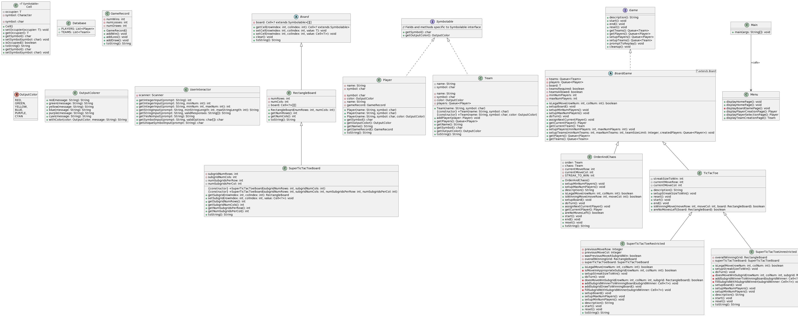

# CS611 Assignment 2: Adding "Super TicTacToe" with Assignment 1's "TicTacToe" and "Order and Chaos"
**Name:** _Reshab Chhabra_

**BU Email:** reshabc@bu.edu

**BUID:** U93403317


**GitHub Repository**: https://github.com/rechhabra/CS611

## Java Object-Oriented Design

The code is ran with `Main.java` which will then prompt `Menu.java` to show my CS611 menu! The rest can be traced easily :).




## How To Run

Run the following in your terminal:
```
javac Main.java
java Main.java
```

To test my code, I used IntelliJ with JDK `1.8.032` (Java8)

## Bonus Points

The following are reasons I believe I deserve bonus points
- **Use of Generics in `Cell.java`** (professor also mentioned students who have used it should earn bonus points)
- **My _advanced custom team creation feature which goes BEYOND** just making random team assignments_
- User-friendly interface with colors
- Very easy-to-understand user interaction

- Addition of **Unrestricted Super TicTactoe game** with **Restricted Super TicTacToe game**, as lab instructor Zheyu pointed out will be granted bonus points
- **Storing player information to be reused in games** -- this feature allows the CS611 menu to grab players to be used in another game!!
- **Storing player game records** -- each player has information about _number of wins, number of draws, and number of losses_


## Resourcing

No use of ChatGPT for this assignment.

## TODOs

As I have been hospitalized atleast 5 times over the past week, I have some TODOs for myself and I would like to make my code _even more_ generalized over time --- I have plenty of ideas!

## Sample Output for Restricted Super Tic Tac Toe (Colors are missing below)

```
Welcome to Reshab Chhabra's CS611 Menu!
1) Play a board game
2) Quit
Select an option (between 1 and 2)
1
1) TicTacToe
2) Order of Chaos
3) (Unrestricted) Super TicTacToe
4) (Restricted)   Super TicTacToe
Select a board game to play (between 1 and 4)
4
Welcome to Restricted Super TicTacToe!
Restricted Super TicTacToe is a variation of TicTacToe where there are subgrids:
Each subgrid is a mini TicTacToe game and whoever wins the mini TicTacToe, would
win a single cell in the "Super" TicTacToe. In the restricted variation, players
can place their symbol only based on the location of where the previous player
placed their symbol. For example. If the previous player placed a symbol on the
top left in any subgrid, then the next player has to place their symbol in the top
left subgrid. Have fun!
Enter the number of rows for each subgrid in the Restricted Super TicTacToe board (atleast 3)
3
Enter the number of cols for each subgrid in the Restricted Super TicTacToe board (atleast 3)
3
This game requires 2 players.
You currently are adding a new player
Enter the new player's name
a
Now you need to input player a's symbol.
Enter player a's symbol.
a
You currently are adding a new player
Enter the new player's name
b
Now you need to input player b's symbol.
Enter player b's symbol.
b
All 2 players have been added.
This board game is team optional. Would you like to add teams? (y/n)
n
It is a (a)'s turn!
+---+---+---+    +---+---+---+    +---+---+---+
|1  |2  |3  |    |4  |5  |6  |    |7  |8  |9  |
+---+---+---+    +---+---+---+    +---+---+---+
|10 |11 |12 |    |13 |14 |15 |    |16 |17 |18 |
+---+---+---+    +---+---+---+    +---+---+---+
|19 |20 |21 |    |22 |23 |24 |    |25 |26 |27 |
+---+---+---+    +---+---+---+    +---+---+---+

+---+---+---+    +---+---+---+    +---+---+---+
|28 |29 |30 |    |31 |32 |33 |    |34 |35 |36 |
+---+---+---+    +---+---+---+    +---+---+---+
|37 |38 |39 |    |40 |41 |42 |    |43 |44 |45 |
+---+---+---+    +---+---+---+    +---+---+---+
|46 |47 |48 |    |49 |50 |51 |    |52 |53 |54 |
+---+---+---+    +---+---+---+    +---+---+---+

+---+---+---+    +---+---+---+    +---+---+---+
|55 |56 |57 |    |58 |59 |60 |    |61 |62 |63 |
+---+---+---+    +---+---+---+    +---+---+---+
|64 |65 |66 |    |67 |68 |69 |    |70 |71 |72 |
+---+---+---+    +---+---+---+    +---+---+---+
|73 |74 |75 |    |76 |77 |78 |    |79 |80 |81 |
+---+---+---+    +---+---+---+    +---+---+---+

Enter an index as displayed by the board (between 1 and 81)
1
It is b (b)'s turn!
+---+---+---+    +---+---+---+    +---+---+---+
| a |2  |3  |    |4  |5  |6  |    |7  |8  |9  |
+---+---+---+    +---+---+---+    +---+---+---+
|10 |11 |12 |    |13 |14 |15 |    |16 |17 |18 |
+---+---+---+    +---+---+---+    +---+---+---+
|19 |20 |21 |    |22 |23 |24 |    |25 |26 |27 |
+---+---+---+    +---+---+---+    +---+---+---+

+---+---+---+    +---+---+---+    +---+---+---+
|28 |29 |30 |    |31 |32 |33 |    |34 |35 |36 |
+---+---+---+    +---+---+---+    +---+---+---+
|37 |38 |39 |    |40 |41 |42 |    |43 |44 |45 |
+---+---+---+    +---+---+---+    +---+---+---+
|46 |47 |48 |    |49 |50 |51 |    |52 |53 |54 |
+---+---+---+    +---+---+---+    +---+---+---+

+---+---+---+    +---+---+---+    +---+---+---+
|55 |56 |57 |    |58 |59 |60 |    |61 |62 |63 |
+---+---+---+    +---+---+---+    +---+---+---+
|64 |65 |66 |    |67 |68 |69 |    |70 |71 |72 |
+---+---+---+    +---+---+---+    +---+---+---+
|73 |74 |75 |    |76 |77 |78 |    |79 |80 |81 |
+---+---+---+    +---+---+---+    +---+---+---+

Enter an index as displayed by the board (between 1 and 81)
12
It is a (a)'s turn!
+---+---+---+    +---+---+---+    +---+---+---+
| a |2  |3  |    |4  |5  |6  |    |7  |8  |9  |
+---+---+---+    +---+---+---+    +---+---+---+
|10 |11 | b |    |13 |14 |15 |    |16 |17 |18 |
+---+---+---+    +---+---+---+    +---+---+---+
|19 |20 |21 |    |22 |23 |24 |    |25 |26 |27 |
+---+---+---+    +---+---+---+    +---+---+---+

+---+---+---+    +---+---+---+    +---+---+---+
|28 |29 |30 |    |31 |32 |33 |    |34 |35 |36 |
+---+---+---+    +---+---+---+    +---+---+---+
|37 |38 |39 |    |40 |41 |42 |    |43 |44 |45 |
+---+---+---+    +---+---+---+    +---+---+---+
|46 |47 |48 |    |49 |50 |51 |    |52 |53 |54 |
+---+---+---+    +---+---+---+    +---+---+---+

+---+---+---+    +---+---+---+    +---+---+---+
|55 |56 |57 |    |58 |59 |60 |    |61 |62 |63 |
+---+---+---+    +---+---+---+    +---+---+---+
|64 |65 |66 |    |67 |68 |69 |    |70 |71 |72 |
+---+---+---+    +---+---+---+    +---+---+---+
|73 |74 |75 |    |76 |77 |78 |    |79 |80 |81 |
+---+---+---+    +---+---+---+    +---+---+---+

Enter an index as displayed by the board (between 1 and 81)
34
It is b (b)'s turn!
+---+---+---+    +---+---+---+    +---+---+---+
| a |2  |3  |    |4  |5  |6  |    |7  |8  |9  |
+---+---+---+    +---+---+---+    +---+---+---+
|10 |11 | b |    |13 |14 |15 |    |16 |17 |18 |
+---+---+---+    +---+---+---+    +---+---+---+
|19 |20 |21 |    |22 |23 |24 |    |25 |26 |27 |
+---+---+---+    +---+---+---+    +---+---+---+

+---+---+---+    +---+---+---+    +---+---+---+
|28 |29 |30 |    |31 |32 |33 |    | a |35 |36 |
+---+---+---+    +---+---+---+    +---+---+---+
|37 |38 |39 |    |40 |41 |42 |    |43 |44 |45 |
+---+---+---+    +---+---+---+    +---+---+---+
|46 |47 |48 |    |49 |50 |51 |    |52 |53 |54 |
+---+---+---+    +---+---+---+    +---+---+---+

+---+---+---+    +---+---+---+    +---+---+---+
|55 |56 |57 |    |58 |59 |60 |    |61 |62 |63 |
+---+---+---+    +---+---+---+    +---+---+---+
|64 |65 |66 |    |67 |68 |69 |    |70 |71 |72 |
+---+---+---+    +---+---+---+    +---+---+---+
|73 |74 |75 |    |76 |77 |78 |    |79 |80 |81 |
+---+---+---+    +---+---+---+    +---+---+---+

Enter an index as displayed by the board (between 1 and 81)
20
It is a (a)'s turn!
+---+---+---+    +---+---+---+    +---+---+---+
| a |2  |3  |    |4  |5  |6  |    |7  |8  |9  |
+---+---+---+    +---+---+---+    +---+---+---+
|10 |11 | b |    |13 |14 |15 |    |16 |17 |18 |
+---+---+---+    +---+---+---+    +---+---+---+
|19 | b |21 |    |22 |23 |24 |    |25 |26 |27 |
+---+---+---+    +---+---+---+    +---+---+---+

+---+---+---+    +---+---+---+    +---+---+---+
|28 |29 |30 |    |31 |32 |33 |    | a |35 |36 |
+---+---+---+    +---+---+---+    +---+---+---+
|37 |38 |39 |    |40 |41 |42 |    |43 |44 |45 |
+---+---+---+    +---+---+---+    +---+---+---+
|46 |47 |48 |    |49 |50 |51 |    |52 |53 |54 |
+---+---+---+    +---+---+---+    +---+---+---+

+---+---+---+    +---+---+---+    +---+---+---+
|55 |56 |57 |    |58 |59 |60 |    |61 |62 |63 |
+---+---+---+    +---+---+---+    +---+---+---+
|64 |65 |66 |    |67 |68 |69 |    |70 |71 |72 |
+---+---+---+    +---+---+---+    +---+---+---+
|73 |74 |75 |    |76 |77 |78 |    |79 |80 |81 |
+---+---+---+    +---+---+---+    +---+---+---+

Enter an index as displayed by the board (between 1 and 81)
58
It is b (b)'s turn!
+---+---+---+    +---+---+---+    +---+---+---+
| a |2  |3  |    |4  |5  |6  |    |7  |8  |9  |
+---+---+---+    +---+---+---+    +---+---+---+
|10 |11 | b |    |13 |14 |15 |    |16 |17 |18 |
+---+---+---+    +---+---+---+    +---+---+---+
|19 | b |21 |    |22 |23 |24 |    |25 |26 |27 |
+---+---+---+    +---+---+---+    +---+---+---+

+---+---+---+    +---+---+---+    +---+---+---+
|28 |29 |30 |    |31 |32 |33 |    | a |35 |36 |
+---+---+---+    +---+---+---+    +---+---+---+
|37 |38 |39 |    |40 |41 |42 |    |43 |44 |45 |
+---+---+---+    +---+---+---+    +---+---+---+
|46 |47 |48 |    |49 |50 |51 |    |52 |53 |54 |
+---+---+---+    +---+---+---+    +---+---+---+

+---+---+---+    +---+---+---+    +---+---+---+
|55 |56 |57 |    | a |59 |60 |    |61 |62 |63 |
+---+---+---+    +---+---+---+    +---+---+---+
|64 |65 |66 |    |67 |68 |69 |    |70 |71 |72 |
+---+---+---+    +---+---+---+    +---+---+---+
|73 |74 |75 |    |76 |77 |78 |    |79 |80 |81 |
+---+---+---+    +---+---+---+    +---+---+---+

...
...
...
```