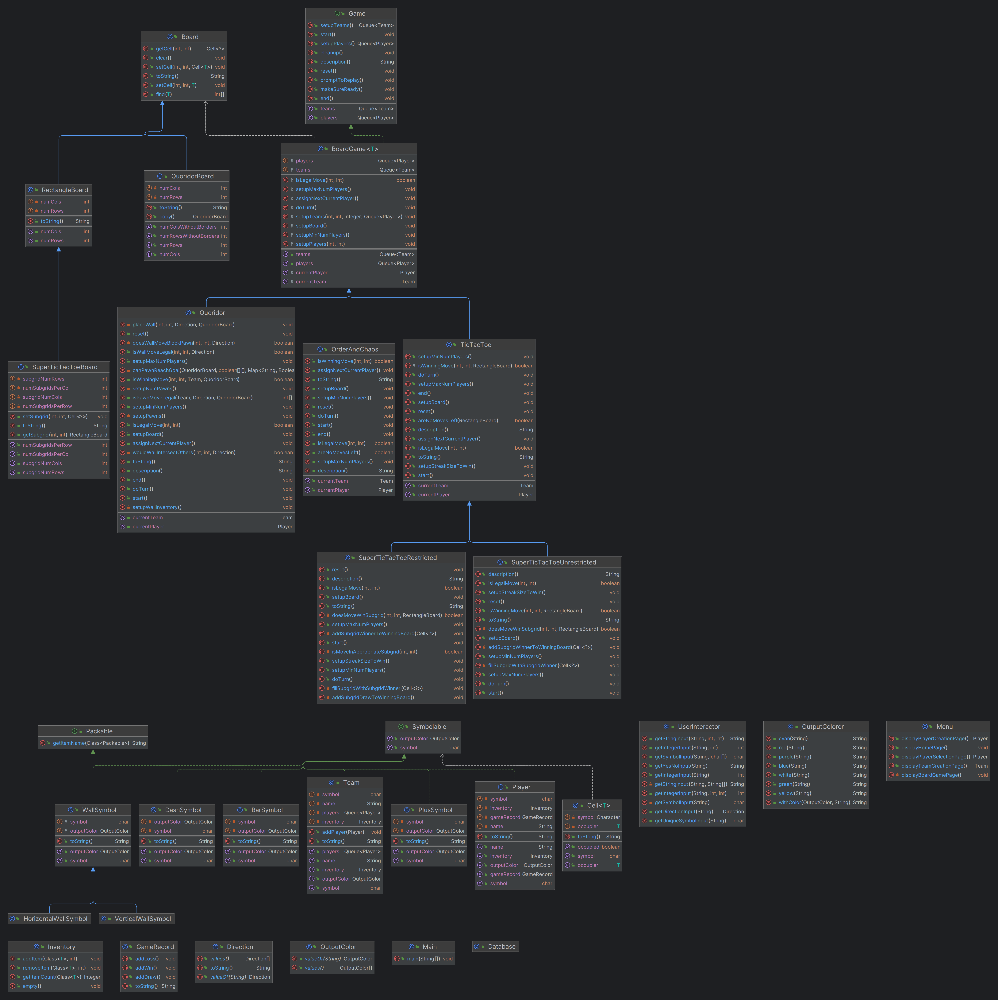

# CS611 Assignment 3: Adding Quoridor Board Game:
**_In addition to previous assignments (which all still work fully!):_**
- "Super TicTacToe" Restricted (Assignment 2 Bonus Game which fully works!)
- "Super TicTacToe" Unrestricted (Assignment 2 normal game which fully works!)
- "TicTacToe" (Assignment 1 which fully works!)
- "Order of Chaos" (Assignment 1 which fully works!)

**Name:** _Reshab Chhabra, Gautam Kalyankar_

**BU Email:** reshabc@bu.edu

**BUID:** U93403317


**GitHub Repository**: https://github.com/rechhabra/CS611

## Java Object-Oriented Design

The code is ran with `Main.java` which will then prompt `Menu.java` to show my CS611 menu! The rest can be traced easily :).

**NOTE:** Please read `CS611 Assignment 3 Design Document.pdf` for additional information on the designs made for this assignment.



## Added files (from Assignment 2 to Assignment 3)
- `BarSymbol.java`
- `DashSymbol.java`
- `Direction.java`
- `HorizontalWallSymbol.java`
- `Inventory.java`
- `PlusSymbol.java`
- `QuoridorBoard.java`
- `TurnBasedGame.java`
- `VerticalWallSymbol.java`
- `WallSymbol.java`
- `Packable.java`

## How To Run

Run the following in your terminal:
```
javac Main.java
java Main.java
```

To test my code, I used IntelliJ with JDK `1.8.032` (Java8)

## Bonus Points

The following are reasons I believe I deserve bonus points
- Pretty design for the walls
- Scalable wall sizes, number of players, and board size
- **My _advanced custom team creation feature which goes BEYOND** just making random team assignments_
- User-friendly interface with colors
- Very easy-to-understand user interaction
- Custom number of players in Order of Chaos -- required was 2 but I scaled the game to work with 3 or 4 players! This also covers cases like jumping over 2+ pawns :).
- **Storing player information to be reused in games** -- this feature allows the CS611 menu to grab players to be used in another game!!
- **Storing player game records** -- each player has information about _number of wins, number of draws, and number of losses_

## Resourcing

No use of ChatGPT for this assignment.

## TODOs

I have TODOs for me which makes me think about future design decisions for future assignments. These will be adjusted over time if needed, as too much abstraction is impractical in the real world unless it is only needed.

## Sample Output for Quoridor _(with Wall Pawn Blocking Checker!)_ (Colors are missing below)

```
Welcome to Reshab Chhabra's CS611 Menu!
1) Play a board game
2) Quit
Select an option (between 1 and 2)
1
1) TicTacToe
2) Order of Chaos
3) (Unrestricted) Super TicTacToe
4) (Restricted)   Super TicTacToe
5) Quoridor (paired with Gautam Kalyankar)
Select a board game to play (between 1 and 5)
5
Welcome to Quoridor!
The objective of Quoridor is to be the first player to reach the opposite side of the game board.
Each player starts with a pawn and a set of wooden fences. On their turn, a player can either 
move their pawn to an adjacent square or place one of their fences on the board to block their 
opponent's path. The fences are placed between the squares and can be used strategically to create obstacles
and impede the progress of the other player(s).

The game requires careful planning, as players must decide whether to advance their own pawn or block their opponents.
The first player to reach the row opposite to their starting position wins the game.
Enter the number of rows for the Quoridor board (atleast 9)
9
Enter the number of cols for the Quoridor board (atleast 9)
9
Enter the number of pawns (between 2 and 4)
2
Enter the number of players (between 2 and 4)
2
You currently are adding a new player
Enter the new player's name
a
Now you need to input player a's symbol.
Enter player a's symbol.
a
You currently are adding a new player
Enter the new player's name
b
Now you need to input player b's symbol.
Enter player b's symbol.
b
All 2 players have been added.
Now you will have to setup the teams for each pawn.
There are 2 to be made.
Since there are 2 players and 2 teams to be made, this can be assigned automatically.
Team a (a): [a (a)] has been added automatically...
Team b (b): [b (b)] has been added automatically...
NORTH PAWN will be a (a): [a (a)]
SOUTH PAWN will be b (b): [b (b)]
Before we start, we'd like to make sure you are ready. Once you are ready, type a very big number (atleast 999)
999
It is a (a)'s from a (a): [a (a)] team's turn!
+---+---+---+---+---+---+---+---+---+
|1  |2  |3  |4  | a |6  |7  |8  |9  |
+---+---+---+---+---+---+---+---+---+
|10 |11 |12 |13 |14 |15 |16 |17 |18 |
+---+---+---+---+---+---+---+---+---+
|19 |20 |21 |22 |23 |24 |25 |26 |27 |
+---+---+---+---+---+---+---+---+---+
|28 |29 |30 |31 |32 |33 |34 |35 |36 |
+---+---+---+---+---+---+---+---+---+
|37 |38 |39 |40 |41 |42 |43 |44 |45 |
+---+---+---+---+---+---+---+---+---+
|46 |47 |48 |49 |50 |51 |52 |53 |54 |
+---+---+---+---+---+---+---+---+---+
|55 |56 |57 |58 |59 |60 |61 |62 |63 |
+---+---+---+---+---+---+---+---+---+
|64 |65 |66 |67 |68 |69 |70 |71 |72 |
+---+---+---+---+---+---+---+---+---+
|73 |74 |75 |76 | b |78 |79 |80 |81 |
+---+---+---+---+---+---+---+---+---+

You can do multiple actions. What would you like to do?
1: Move pawn
2: Place a wall (10 left) (between 1 and 2)
2
Enter an index as displayed by the board to place down the wall (between 1 and 81)
68
Which side of the cell 68 do you want to place the wall? [up, down, left, right]
down
It is b (b)'s from b (b): [b (b)] team's turn!
+---+---+---+---+---+---+---+---+---+
|1  |2  |3  |4  | a |6  |7  |8  |9  |
+---+---+---+---+---+---+---+---+---+
|10 |11 |12 |13 |14 |15 |16 |17 |18 |
+---+---+---+---+---+---+---+---+---+
|19 |20 |21 |22 |23 |24 |25 |26 |27 |
+---+---+---+---+---+---+---+---+---+
|28 |29 |30 |31 |32 |33 |34 |35 |36 |
+---+---+---+---+---+---+---+---+---+
|37 |38 |39 |40 |41 |42 |43 |44 |45 |
+---+---+---+---+---+---+---+---+---+
|46 |47 |48 |49 |50 |51 |52 |53 |54 |
+---+---+---+---+---+---+---+---+---+
|55 |56 |57 |58 |59 |60 |61 |62 |63 |
+---+---+---+---+---+---+---+---+---+
|64 |65 |66 |67 |68 |69 |70 |71 |72 |
+---+---+---+---■■■■■■■■■---+---+---+
|73 |74 |75 |76 | b |78 |79 |80 |81 |
+---+---+---+---+---+---+---+---+---+

You can do multiple actions. What would you like to do?
1: Move pawn
2: Place a wall (10 left) (between 1 and 2)
2
Enter an index as displayed by the board to place down the wall (between 1 and 81)
70
Which side of the cell 70 do you want to place the wall? [up, down, left, right]
left
It is a (a)'s from a (a): [a (a)] team's turn!
+---+---+---+---+---+---+---+---+---+
|1  |2  |3  |4  | a |6  |7  |8  |9  |
+---+---+---+---+---+---+---+---+---+
|10 |11 |12 |13 |14 |15 |16 |17 |18 |
+---+---+---+---+---+---+---+---+---+
|19 |20 |21 |22 |23 |24 |25 |26 |27 |
+---+---+---+---+---+---+---+---+---+
|28 |29 |30 |31 |32 |33 |34 |35 |36 |
+---+---+---+---+---+---+---+---+---+
|37 |38 |39 |40 |41 |42 |43 |44 |45 |
+---+---+---+---+---+---+---+---+---+
|46 |47 |48 |49 |50 |51 |52 |53 |54 |
+---+---+---+---+---+---+---+---+---+
|55 |56 |57 |58 |59 |60 |61 |62 |63 |
+---+---+---+---+---+---█---+---+---+
|64 |65 |66 |67 |68 |69 █70 |71 |72 |
+---+---+---+---■■■■■■■■█---+---+---+
|73 |74 |75 |76 | b |78 █79 |80 |81 |
+---+---+---+---+---+---█---+---+---+

You can do multiple actions. What would you like to do?
1: Move pawn
2: Place a wall (9 left) (between 1 and 2)
67
The inputted number 67 is not between 1 and 2.
You can do multiple actions. What would you like to do?
1: Move pawn
2: Place a wall (9 left) (between 1 and 2)
2
Enter an index as displayed by the board to place down the wall (between 1 and 81)
67
Which side of the cell 67 do you want to place the wall? [up, down, left, right]
right
Wall placement is invalid: check if a wall is already there or if the proposed wall placement would go off
the board. Be sure to also check if the wall blocks other player(s) from having a winning path.
Enter an index as displayed by the board to place down the wall (between 1 and 81)
66
Which side of the cell 66 do you want to place the wall? [up, down, left, right]
right
It is b (b)'s from b (b): [b (b)] team's turn!
+---+---+---+---+---+---+---+---+---+
|1  |2  |3  |4  | a |6  |7  |8  |9  |
+---+---+---+---+---+---+---+---+---+
|10 |11 |12 |13 |14 |15 |16 |17 |18 |
+---+---+---+---+---+---+---+---+---+
|19 |20 |21 |22 |23 |24 |25 |26 |27 |
+---+---+---+---+---+---+---+---+---+
|28 |29 |30 |31 |32 |33 |34 |35 |36 |
+---+---+---+---+---+---+---+---+---+
|37 |38 |39 |40 |41 |42 |43 |44 |45 |
+---+---+---+---+---+---+---+---+---+
|46 |47 |48 |49 |50 |51 |52 |53 |54 |
+---+---+---+---+---+---+---+---+---+
|55 |56 |57 |58 |59 |60 |61 |62 |63 |
+---+---+---█---+---+---█---+---+---+
|64 |65 |66 █67 |68 |69 █70 |71 |72 |
+---+---+---█---■■■■■■■■█---+---+---+
|73 |74 |75 █76 | b |78 █79 |80 |81 |
+---+---+---█---+---+---█---+---+---+

You can do multiple actions. What would you like to do?
1: Move pawn
2: Place a wall (9 left) (between 1 and 2)
1
What direction would you like to move your pawn? [up, down, left, right]
up
The direction up cannot be made.
What direction would you like to move your pawn? [up, down, left, right]
left
Team b (b): [b (b)] has 9 walls left to place.
It is a (a)'s from a (a): [a (a)] team's turn!
+---+---+---+---+---+---+---+---+---+
|1  |2  |3  |4  | a |6  |7  |8  |9  |
+---+---+---+---+---+---+---+---+---+
|10 |11 |12 |13 |14 |15 |16 |17 |18 |
+---+---+---+---+---+---+---+---+---+
|19 |20 |21 |22 |23 |24 |25 |26 |27 |
+---+---+---+---+---+---+---+---+---+
|28 |29 |30 |31 |32 |33 |34 |35 |36 |
+---+---+---+---+---+---+---+---+---+
|37 |38 |39 |40 |41 |42 |43 |44 |45 |
+---+---+---+---+---+---+---+---+---+
|46 |47 |48 |49 |50 |51 |52 |53 |54 |
+---+---+---+---+---+---+---+---+---+
|55 |56 |57 |58 |59 |60 |61 |62 |63 |
+---+---+---█---+---+---█---+---+---+
|64 |65 |66 █67 |68 |69 █70 |71 |72 |
+---+---+---█---■■■■■■■■█---+---+---+
|73 |74 |75 █ b |77 |78 █79 |80 |81 |
+---+---+---█---+---+---█---+---+---+

You can do multiple actions. What would you like to do?
1: Move pawn
2: Place a wall (8 left) (between 1 and 2)
...
...
...
```
