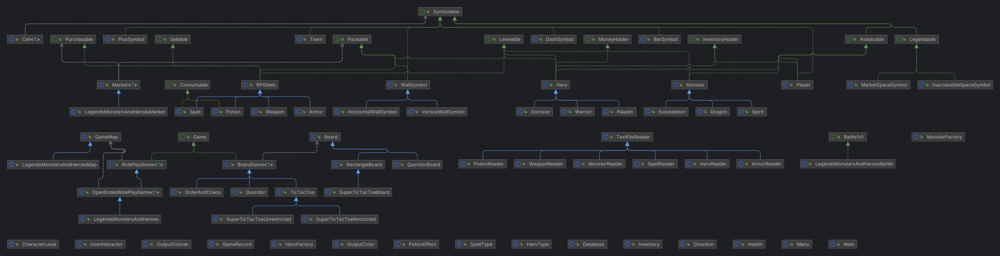

# CS611 Assignment 4: "Adding Legends: Monsters and Heroes" game
**_In addition to previous assignments (which all still work fully!):_**
- "Quoridor" (Assignment 3)
- "Super TicTacToe" Restricted (Assignment 2 bonus game)
- "Super TicTacToe" Unrestricted (Assignment 2 normal game)
- "TicTacToe" (Assignment 1)
- "Order of Chaos" (Assignment 1)

**Name:** _Reshab Chhabra_

**BU Email:** reshabc@bu.edu

**BUID:** U93403317


**GitHub Repository**: [CS611](https://github.com/rechhabra/CS611)

## Java Object-Oriented Design

The code is ran with `Main.java` which will then prompt `Menu.java` to show my CS611 menu! The rest can be traced easily :).

**NOTE:** Please read `CS611 Assignment 4 Design Document.pdf` for additional information on the designs made for this assignment.

### Cumulative Diagram <small><small><small>(Containing all games' structures)</small></small></small>


### Assignment 4 UML Diagram <small><small><small>(Only "Legends of Monsters and Heroes" game)</small></small></small>


_To view the image files, see the [`assignment_uml_diagrams/`](../assignment_uml_diagrams) folder._

## How To Run

Run the following in your terminal:
```
javac Main.java
java Main.java
```

To test my code, I used IntelliJ with JDK `1.8.032` (Java8)

## Bonus Points

The following are reasons I believe I deserve bonus points
- **Valid map generation** -- uses BFS to ensure the inaccessible spaces aren't placed to create maps that close corners or close the player into a submap!
- **Storing player game records** -- each player has information about _number of wins, number of draws, and number of losses_
- **(Computer monster) Optimized battle: Monsters fight strategically**: monsters fight well using a well-made greedy algorithm.
- **Saving player data!!!** - as this is an RPG game and will take a while, the player is able to leave a game and join in with the same heroes.
  - For a demo of this, see the following mini code snippet:

      ```
      Legends: Monsters and Heroes is a single player Open-Ended Role-Playing Game. The player can select 1-3
      heroes to use in battle, and these heroes would respectively fight 1-3 monsters when the player
      encounters an area where monsters are. Fight to gain level and power and ultimately beat all the
      monsters in the game!
      Note this game has no end as it is open-ended, but there's no end to fighting --- it gets more fun!
      Enter the number of rows for the map (between 8 and 20)
      8
      Enter the number of cols for the map (between 8 and 20)
      20
      Generating a valid map...
      This game requires 1 players.
      You have created some players already. Would you like to add them? (y/n)
      y
      You are currently selecting a player
      1) Player1 (P)
       Select the desired player by its number. (between 1 and 1)
       1
       Selected players have been added.
       All 1 player(s) have been added.
       Now we are setting up the heroes
       You have the following heroes already:
       Garl_Glittergold
      - level:        Level 1 (5 / 10 exp)
      - health:       1000 / 1000 + 0 + 0
      - mana:         100 + 0
      - strength:     600 + 0
      - dexterity:    400 + 0
      - agility:      500 + 0
      - gold:         2500
      Would you like to reuse them? (y/n)
      y
      ```
  
- Very easy to understand instructions in game
- Very neat map layout
- Very neat outputting e.g. inventory
- Use of factory pattern to generate a `Hero`, `Monster`, and `RPGItem`.
- User-friendly interface with colors
- **Use of avatars for heroes and monsters, a cool battle experience**
- **Storing player information to be reused in games** -- this feature allows the CS611 menu to grab players to be used in another game!!

## Resources
No use of ChatGPT for this assignment.

## TODOs

I have TODOs for me which makes me think about future design decisions for future assignments. These will be adjusted over time if needed, as too much abstraction is impractical in the real world unless it is only needed.

## Sample Run for "Legends: Monsters and Heroes" _with explanations!_
(Missing colors)

```
1) Play a board game
2) Play a role play game
3) Quit
Select an option (between 1 and 3)
2
1) Legends: Monsters and Heroes
2) Back
Select a role play game to play (between 1 and 2)
1
Legends: Monsters and Heroes is a single player Open-Ended Role-Playing Game. The player can select 1-3
heroes to use in battle, and these heroes would respectively fight 1-3 monsters when the player
encounters an area where monsters are. Fight to gain level and power and ultimately beat all the
monsters in the game!
Note this game has no end as it is open-ended, but there's no end to fighting --- it gets more fun!
Enter the number of rows for the map (between 8 and 20)
8
Enter the number of cols for the map (between 8 and 20)
8
```
> I am aware the map size is 8x8 but added a bigger map to make it more fun
```
Generating a valid map...
```
> Ensuring a valid map is generated by using BFS (see bonus explanation for more)
```
This game requires 1 players.
You currently are adding a new player
Enter the new player's name
Player1
Now you need to input player Player1's symbol.
Enter player Player1's symbol.
P
All 1 player(s) have been added.
Now we are setting up the heroes
There are three types of heroes, each with their own balance of skills:
• Warriors are favored on strength and agility.
• Sorcerers are favored on dexterity and agility.
• Paladins are favored on strength and dexterity.
How many heroes do you want? (between 1 and 3)
2
You are currently selecting Hero number 1 of 2
Select what type of Hero you would like to equip (you can select multiple of the same) [warrior, sorcerer, paladin]
warrior
Select which warrior hero you'd like:
1) Gaerdal_Ironhand
 - level:        Level 1 (7 / 10 exp)
 - health:       1000 / 1000 + 0 + 0
 - mana:         100 + 0
 - strength:     700 + 0
 - dexterity:    600 + 0
 - agility:      500 + 0
 - gold:         1354
2) Sehanine_Monnbow
 - level:        Level 1 (8 / 10 exp)
 - health:       1000 / 1000 + 0 + 0
 - mana:         600 + 0
 - strength:     700 + 0
 - dexterity:    500 + 0
 - agility:      800 + 0
 - gold:         2500
3) Muamman_Duathall
 - level:        Level 1 (6 / 10 exp)
 - health:       1000 / 1000 + 0 + 0
 - mana:         300 + 0
 - strength:     900 + 0
 - dexterity:    750 + 0
 - agility:      500 + 0
 - gold:         2546
4) Flandal_Steelskin
 - level:        Level 1 (7 / 10 exp)
 - health:       1000 / 1000 + 0 + 0
 - mana:         200 + 0
 - strength:     750 + 0
 - dexterity:    700 + 0
 - agility:      650 + 0
 - gold:         2500
5) Undefeated_Yoj
 - level:        Level 1 (7 / 10 exp)
 - health:       1000 / 1000 + 0 + 0
 - mana:         400 + 0
 - strength:     800 + 0
 - dexterity:    700 + 0
 - agility:      400 + 0
 - gold:         2500
6) Eunoia_Cyn
 - level:        Level 1 (6 / 10 exp)
 - health:       1000 / 1000 + 0 + 0
 - mana:         400 + 0
 - strength:     700 + 0
 - dexterity:    600 + 0
 - agility:      800 + 0
 - gold:         2500
```
> Here we see 6 options provided, as when selecting all heroes of a specific type they choose will be displayed.
>
> The `+ 0` on all the features indicates a potion effect, typically used in battle and lasts only in a battle.
>
> The `health` has an extra `+ 0` which demonstrates an armor effect. This is color coded to see better, but as GitHub doesn't support color text, it cannot be displayed here.
```
Choose by number (between 1 and 6)
1
Hero Gaerdal_Ironhand was successfully added.
Hero's starting inventory:
Inventory:
 - Sword
       - level 1
       - damage 800
       - # of hands 1
```
> Each hero is given a weapon at the start. This initial weapon provided is dependent on what type of hero you select.
```
You are currently selecting Hero number 2 of 2
Select what type of Hero you would like to equip (you can select multiple of the same) [warrior, sorcerer, paladin]
sorcerer
Select which sorcerer hero you'd like:
1) Rillifane_Rallathil
 - level:        Level 1 (9 / 10 exp)
 - health:       1000 / 1000 + 0 + 0
 - mana:         1300 + 0
 - strength:     750 + 0
 - dexterity:    500 + 0
 - agility:      450 + 0
 - gold:         2500
2) Segojan_Earthcaller
 - level:        Level 1 (5 / 10 exp)
 - health:       1000 / 1000 + 0 + 0
 - mana:         900 + 0
 - strength:     800 + 0
 - dexterity:    650 + 0
 - agility:      500 + 0
 - gold:         2500
3) Reign_Havoc
 - level:        Level 1 (8 / 10 exp)
 - health:       1000 / 1000 + 0 + 0
 - mana:         800 + 0
 - strength:     800 + 0
 - dexterity:    800 + 0
 - agility:      800 + 0
 - gold:         2500
4) Reverie_Ashels
 - level:        Level 1 (7 / 10 exp)
 - health:       1000 / 1000 + 0 + 0
 - mana:         900 + 0
 - strength:     800 + 0
 - dexterity:    400 + 0
 - agility:      700 + 0
 - gold:         2500
5) Kalabar
 - level:        Level 1 (6 / 10 exp)
 - health:       1000 / 1000 + 0 + 0
 - mana:         800 + 0
 - strength:     850 + 0
 - dexterity:    600 + 0
 - agility:      400 + 0
 - gold:         2500
6) Skye_Soar
 - level:        Level 1 (5 / 10 exp)
 - health:       1000 / 1000 + 0 + 0
 - mana:         1000 + 0
 - strength:     700 + 0
 - dexterity:    500 + 0
 - agility:      400 + 0
 - gold:         2500
Choose by number (between 1 and 6)
2
Hero Segojan_Earthcaller was successfully added.
Hero's starting inventory:
Inventory:
 - Dagger
       - level 1
       - damage 250
       - # of hands 1

 - Heat_Wave (5 use(s) left)
       - level 1
       - damage 560
       - mana required 138


Before we start, we'd like to make sure you are ready. Once you are ready, type a very big number (atleast 999)
999
■■■■■■■■■■■■■■■■■■■ 
█ P █   █ $       █ 
█         █       █ 
█   █ $   $       █ 
█         █ █ $ █ █ 
█         █     $ █ 
█       $     █ $ █ 
█   █   █         █ 
█           █     █ 
■■■■■■■■■■■■■■■■■■■ 
+------------------------+
$ Market
█ Inaccessible Space
+------------------------+

What would you like to do: move (wasd), see inventory (i), quit (q)
s
■■■■■■■■■■■■■■■■■■■ 
█   █   █ $       █ 
█ P       █       █ 
█   █ $   $       █ 
█         █ █ $ █ █ 
█         █     $ █ 
█       $     █ $ █ 
█   █   █         █ 
█           █     █ 
■■■■■■■■■■■■■■■■■■■ 
+------------------------+
$ Market
█ Inaccessible Space
+------------------------+

What would you like to do: move (wasd), see inventory (i), quit (q)
d
■■■■■■■■■■■■■■■■■■■ 
█   █   █ $       █ 
█   P     █       █ 
█   █ $   $       █ 
█         █ █ $ █ █ 
█         █     $ █ 
█       $     █ $ █ 
█   █   █         █ 
█           █     █ 
■■■■■■■■■■■■■■■■■■■ 
+------------------------+
$ Market
█ Inaccessible Space
+------------------------+

What would you like to do: move (wasd), see inventory (i), quit (q)
d
YOU'VE WALKED INTO BATTLE!
 E   N  
E|∃ <_/ 
/ \     
 1   2  


 G   S  
/#\ -|- 
/ \ |^| 
 1   2  
Monsters:
1) Exodia | Level: 1 | Health: 1128 / 1128
2) Natsunomeryu | Level: 1 | Health: 2070 / 2070

Heroes:
1) Gaerdal_Ironhand | Level: Level 1 (7 / 10 exp) | Health: 1000 / 1000
2) Segojan_Earthcaller | Level: Level 1 (5 / 10 exp) | Health: 1000 / 1000

1) Attack, using a hero’s equipped weapon
2) Cast a spell from a hero’s inventory
3) Use a potion from a hero’s inventory
4) Equip a weapon or piece of armor for a hero
5) View your overall inventory.
6) View the opponents' inventory.
```
> Above is the battle screen, which displays the monsters' and heroes' avatars. 
> Each monster and hero's avatar are dependent on their name and the type of 
> monster/hero they are. The options provided for the battle were all instructed
> to be put.
```
What action would you like to take? (between 1 and 6)
1
1) Gaerdal_Ironhand
2) Segojan_Earthcaller
Select the desired hero (between 1 and 2)
1
Hero Gaerdal_Ironhand does not appear to have a weapon equipped
```
> Code will ensure that a hero has a weapon equipped in order for them
> to actually battle a monster.
```
You have the following equipped:
 - Weapon: null
 - Armor:  null
Would you like to equip a "weapon" or "armor"?
weapon
1) Sword
 - level 1
 - damage 800
 - # of hands 1

Select a weapon to equip by its number (between 1 and 1)
1
Gaerdal_Ironhand has equipped weapon Sword
Who do you want to attack with Sword?
1) Exodia
2) Natsunomeryu
Select the desired monster (between 1 and 2)
1
Since this is equipped with one hand, the attack would yield 932 damage!
Gaerdal_Ironhand has attacked Exodia for a potential of 932 damage!
Exodia has taken 899 damage!
Monster Exodia has attacked Gaerdal_Ironhand!
Hero Gaerdal_Ironhand has taken 543 damage!
Hero Gaerdal_Ironhand has healed slightly
Hero Gaerdal_Ironhand has gained some mana
Hero Segojan_Earthcaller has healed slightly
Hero Segojan_Earthcaller has gained some mana
```
> As instructed, after each round, each alive hero will gain some health and some mana (mana is used to cast spells).
```
 E   N  
E|∃ <_/ 
/ \     
 1   2  


 G   S  
/#\ -|- 
/ \ |^| 
 1   2  
Monsters:
1) Exodia | Level: 1 | Health: 196 / 1128
2) Natsunomeryu | Level: 1 | Health: 2070 / 2070

Heroes:
1) Gaerdal_Ironhand | Level: Level 1 (7 / 10 exp) | Health: 502 / 1000
2) Segojan_Earthcaller | Level: Level 1 (5 / 10 exp) | Health: 1000 / 1000

1) Attack, using a hero’s equipped weapon
2) Cast a spell from a hero’s inventory
3) Use a potion from a hero’s inventory
4) Equip a weapon or piece of armor for a hero
5) View your overall inventory.
6) View the opponents' inventory.

What action would you like to take? (between 1 and 6)
1
1) Gaerdal_Ironhand
2) Segojan_Earthcaller
Select the desired hero (between 1 and 2)
1
Who do you want to attack with Sword?
1) Exodia
2) Natsunomeryu
Select the desired monster (between 1 and 2)
1
Since this is equipped with one hand, the attack would yield 932 damage!
Gaerdal_Ironhand has attacked Exodia for a potential of 932 damage!
Exodia has taken 899 damage!
Monster Exodia has fainted!
Monster Natsunomeryu has attacked Gaerdal_Ironhand!
Hero Gaerdal_Ironhand has taken 100 damage!
Hero Gaerdal_Ironhand has healed slightly
Hero Gaerdal_Ironhand has gained some mana
Hero Segojan_Earthcaller has healed slightly
Hero Segojan_Earthcaller has gained some mana
 N  
<_/ 
    
 1  


 G   S  
/#\ -|- 
/ \ |^| 
 1   2  
Monsters:
1) Natsunomeryu | Level: 1 | Health: 2070 / 2070

Heroes:
1) Gaerdal_Ironhand | Level: Level 1 (7 / 10 exp) | Health: 442 / 1000
2) Segojan_Earthcaller | Level: Level 1 (5 / 10 exp) | Health: 1000 / 1000

1) Attack, using a hero’s equipped weapon
2) Cast a spell from a hero’s inventory
3) Use a potion from a hero’s inventory
4) Equip a weapon or piece of armor for a hero
5) View your overall inventory.
6) View the opponents' inventory.

What action would you like to take? (between 1 and 6)
1
1) Gaerdal_Ironhand
2) Segojan_Earthcaller
Select the desired hero (between 1 and 2)
2
Hero Segojan_Earthcaller does not appear to have a weapon equipped
You have the following equipped:
 - Weapon: null
 - Armor:  null
Would you like to equip a "weapon" or "armor"?
weapon
1) Dagger
 - level 1
 - damage 250
 - # of hands 1

Select a weapon to equip by its number (between 1 and 1)
1
Segojan_Earthcaller has equipped weapon Dagger
Who do you want to attack with Dagger?
1) Natsunomeryu
Select the desired monster (between 1 and 1)
1
Since this is equipped with one hand, the attack would yield 292 damage!
Segojan_Earthcaller has attacked Natsunomeryu for a potential of 292 damage!
Natsunomeryu has taken 287 damage!
Monster Natsunomeryu has attacked Gaerdal_Ironhand!
Hero Gaerdal_Ironhand has taken 100 damage!
Hero Gaerdal_Ironhand has healed slightly
Hero Gaerdal_Ironhand has gained some mana
Hero Segojan_Earthcaller has healed slightly
Hero Segojan_Earthcaller has gained some mana
 N  
<_/ 
    
 1  


 G   S  
/#\ -|- 
/ \ |^| 
 1   2  
Monsters:
1) Natsunomeryu | Level: 1 | Health: 1778 / 2070

Heroes:
1) Gaerdal_Ironhand | Level: Level 1 (7 / 10 exp) | Health: 376 / 1000
2) Segojan_Earthcaller | Level: Level 1 (5 / 10 exp) | Health: 1000 / 1000

1) Attack, using a hero’s equipped weapon
2) Cast a spell from a hero’s inventory
3) Use a potion from a hero’s inventory
4) Equip a weapon or piece of armor for a hero
5) View your overall inventory.
6) View the opponents' inventory.

What action would you like to take? (between 1 and 6)
2
1) Gaerdal_Ironhand
2) Segojan_Earthcaller
Select the desired hero (between 1 and 2)
2
1) Heat_Wave (5 use(s) left)
 - level 1
 - damage 560
 - mana required 138
Select which spell you'd like to use (between 1 and 1)
1
1) Natsunomeryu
Select the desired monster (between 1 and 1)
1
Spell Heat_Wave (5 use(s) left) has been shot at to Monster Natsunomeryu!
Natsunomeryu has taken 585 damage!
As this is a fire spell, monster Natsunomeryu has their defense reduced to 180!
```
> Spells can also be casted in the hero has enough mana. Notice above that different spell types results in different effects -- as a spell is being casted or shot at a monster, spells have effects too that last in battle. 
```
Monster Natsunomeryu has attacked Gaerdal_Ironhand!
Hero Gaerdal_Ironhand has taken 100 damage!
Hero Gaerdal_Ironhand has healed slightly
Hero Gaerdal_Ironhand has gained some mana
Hero Segojan_Earthcaller has healed slightly
Hero Segojan_Earthcaller has gained some mana
 N  
<_/ 
    
 1  


 G   S  
/#\ -|- 
/ \ |^| 
 1   2  
Monsters:
1) Natsunomeryu | Level: 1 | Health: 1182 / 2070

Heroes:
1) Gaerdal_Ironhand | Level: Level 1 (7 / 10 exp) | Health: 303 / 1000
2) Segojan_Earthcaller | Level: Level 1 (5 / 10 exp) | Health: 1000 / 1000

1) Attack, using a hero’s equipped weapon
2) Cast a spell from a hero’s inventory
3) Use a potion from a hero’s inventory
4) Equip a weapon or piece of armor for a hero
5) View your overall inventory.
6) View the opponents' inventory.

What action would you like to take? (between 1 and 6)
1
1) Gaerdal_Ironhand
2) Segojan_Earthcaller
Select the desired hero (between 1 and 2)
1
Who do you want to attack with Sword?
1) Natsunomeryu
Select the desired monster (between 1 and 1)
1
Since this is equipped with one hand, the attack would yield 932 damage!
Gaerdal_Ironhand has attacked Natsunomeryu for a potential of 932 damage!
Natsunomeryu has taken 916 damage!
Monster Natsunomeryu has attacked Gaerdal_Ironhand!
Hero Gaerdal_Ironhand has taken 100 damage!
Hero Gaerdal_Ironhand has healed slightly
Hero Gaerdal_Ironhand has gained some mana
Hero Segojan_Earthcaller has healed slightly
Hero Segojan_Earthcaller has gained some mana
 N  
<_/ 
    
 1  


 G   S  
/#\ -|- 
/ \ |^| 
 1   2  
Monsters:
1) Natsunomeryu | Level: 1 | Health: 250 / 2070

Heroes:
1) Gaerdal_Ironhand | Level: Level 1 (7 / 10 exp) | Health: 223 / 1000
2) Segojan_Earthcaller | Level: Level 1 (5 / 10 exp) | Health: 1000 / 1000

1) Attack, using a hero’s equipped weapon
2) Cast a spell from a hero’s inventory
3) Use a potion from a hero’s inventory
4) Equip a weapon or piece of armor for a hero
5) View your overall inventory.
6) View the opponents' inventory.

What action would you like to take? (between 1 and 6)
1
1) Gaerdal_Ironhand
2) Segojan_Earthcaller
Select the desired hero (between 1 and 2)
1
Who do you want to attack with Sword?
1) Natsunomeryu
Select the desired monster (between 1 and 1)
1
Since this is equipped with one hand, the attack would yield 932 damage!
Gaerdal_Ironhand has attacked Natsunomeryu for a potential of 932 damage!
Natsunomeryu has dodged the attack!

```
> Monsters and heroes both have a chance of dodging an attack. Heroes' agility feature is something that increases with either potions or level increase, and are vital to becoming a better hero to survive in later levels.
```
Monster Natsunomeryu has attacked Gaerdal_Ironhand!
Hero Gaerdal_Ironhand has taken 100 damage!
Hero Gaerdal_Ironhand has healed slightly
Hero Gaerdal_Ironhand has gained some mana
Hero Segojan_Earthcaller has healed slightly
Hero Segojan_Earthcaller has gained some mana
 N  
<_/ 
    
 1  


 G   S  
/#\ -|- 
/ \ |^| 
 1   2  
Monsters:
1) Natsunomeryu | Level: 1 | Health: 250 / 2070

Heroes:
1) Gaerdal_Ironhand | Level: Level 1 (7 / 10 exp) | Health: 135 / 1000
2) Segojan_Earthcaller | Level: Level 1 (5 / 10 exp) | Health: 1000 / 1000

1) Attack, using a hero’s equipped weapon
2) Cast a spell from a hero’s inventory
3) Use a potion from a hero’s inventory
4) Equip a weapon or piece of armor for a hero
5) View your overall inventory.
6) View the opponents' inventory.

What action would you like to take? (between 1 and 6)
1
1) Gaerdal_Ironhand
2) Segojan_Earthcaller
Select the desired hero (between 1 and 2)
1
Who do you want to attack with Sword?
1) Natsunomeryu
Select the desired monster (between 1 and 1)
1
Since this is equipped with one hand, the attack would yield 932 damage!
Gaerdal_Ironhand has attacked Natsunomeryu for a potential of 932 damage!
Natsunomeryu has dodged the attack!
Monster Natsunomeryu has attacked Gaerdal_Ironhand!
Hero Gaerdal_Ironhand has taken 100 damage!
Hero Gaerdal_Ironhand has healed slightly
Hero Gaerdal_Ironhand has gained some mana
Hero Segojan_Earthcaller has healed slightly
Hero Segojan_Earthcaller has gained some mana
 N  
<_/ 
    
 1  


 G   S  
/#\ -|- 
/ \ |^| 
 1   2  
Monsters:
1) Natsunomeryu | Level: 1 | Health: 250 / 2070

Heroes:
1) Gaerdal_Ironhand | Level: Level 1 (7 / 10 exp) | Health: 38 / 1000
2) Segojan_Earthcaller | Level: Level 1 (5 / 10 exp) | Health: 1000 / 1000

1) Attack, using a hero’s equipped weapon
2) Cast a spell from a hero’s inventory
3) Use a potion from a hero’s inventory
4) Equip a weapon or piece of armor for a hero
5) View your overall inventory.
6) View the opponents' inventory.

What action would you like to take? (between 1 and 6)
1
1) Gaerdal_Ironhand
2) Segojan_Earthcaller
Select the desired hero (between 1 and 2)
1
Who do you want to attack with Sword?
1) Natsunomeryu
Select the desired monster (between 1 and 1)
1
Since this is equipped with one hand, the attack would yield 932 damage!
Gaerdal_Ironhand has attacked Natsunomeryu for a potential of 932 damage!
Natsunomeryu has taken 916 damage!
Monster Natsunomeryu has fainted!
Heroes have won the battle!
Hero Gaerdal_Ironhand has been rewarded 7 experience!
Hero Gaerdal_Ironhand has been rewarded 100 gold!
Item Sword has leveled up to level 2!
Gaerdal_Ironhand has leveled up to level 2! View your inventory to see full upgrade information.
```
> For any equipped item a hero has, that will also be leveled up with the Hero.
```
Hero Segojan_Earthcaller has been rewarded 7 experience!
Hero Segojan_Earthcaller has been rewarded 100 gold!
Item Dagger has leveled up to level 2!
Segojan_Earthcaller has leveled up to level 2! View your inventory to see full upgrade information.
■■■■■■■■■■■■■■■■■■■ 
█   █   █ $       █ 
█     P   █       █ 
█   █ $   $       █ 
█         █ █ $ █ █ 
█         █     $ █ 
█       $     █ $ █ 
█   █   █         █ 
█           █     █ 
■■■■■■■■■■■■■■■■■■■ 
+------------------------+
$ Market
█ Inaccessible Space
+------------------------+

What would you like to do: move (wasd), see inventory (i), quit (q)
s
```
Below, you will notice the `P` disappeared and a `$` appeared. This 
is because the player is in the shop. **NOTE** that since this is missing
color, this may seem confusing but really in the actual game you will 
notice the `$` will be color coded to indicate the player is there.
```
■■■■■■■■■■■■■■■■■■■ 
█   █   █ $       █ 
█         █       █ 
█   █ $   $       █ 
█         █ █ $ █ █ 
█         █     $ █ 
█       $     █ $ █ 
█   █   █         █ 
█           █     █ 
■■■■■■■■■■■■■■■■■■■ 
+------------------------+
$ Market
█ Inaccessible Space
+------------------------+

What would you like to do: move (wasd), see inventory (i), quit (q), enter market (m)
i
```
> The inventory will display the player's avatar and their items with respective details seen below.
```
+---+
| P | Player1 (P)
|-|-| (0-0-0)
|/ \|
+---+

Player1 (P)'s Inventory:
 - Gaerdal_Ironhand
      Equipped:
       Weapon: Sword
       - level 2
       - damage 864
       - # of hands 1
       Armor: null
      
      Stats:
       - level:        Level 2 (4 / 13 exp)
       - health:       2100 / 2100 + 0 + 0
       - mana:         109 + 0
       - strength:     812 + 0
       - dexterity:    612 + 0
       - agility:      555 + 0
       - gold:         1474

      Gaerdal_Ironhand's Inventory:
 - Segojan_Earthcaller
      Equipped:
       Weapon: Dagger
       - level 2
       - damage 270
       - # of hands 1
       Armor: null
      
      Stats:
       - level:        Level 2 (2 / 13 exp)
       - health:       2100 / 2100 + 0 + 0
       - mana:         843 + 0
       - strength:     800 + 0
       - dexterity:    734 + 0
       - agility:      580 + 0
       - gold:         2620

      Segojan_Earthcaller's Inventory:
       - Heat_Wave (4 use(s) left)
             - level 1
             - damage 560
             - mana required 138

Type ok when you are done looking
ok
■■■■■■■■■■■■■■■■■■■ 
█   █   █ $       █ 
█         █       █ 
█   █ $   $       █ 
█         █ █ $ █ █ 
█         █     $ █ 
█       $     █ $ █ 
█   █   █         █ 
█           █     █ 
■■■■■■■■■■■■■■■■■■■ 
+------------------------+
$ Market
█ Inaccessible Space
+------------------------+

What would you like to do: move (wasd), see inventory (i), quit (q), enter market (m)
m
1) Gaerdal_Ironhand
2) Segojan_Earthcaller
Which hero do you want to use when shopping? (between 1 and 2)
1
Welcome to Market '9'!
```
>Each market is named based on their location on the map.
```
Would you like to "sell" or "buy" an item, or "quit"?
buy
The following items are sold here:

1) Lava_Comet (5 use(s) left) (Spell)
 - level 52
 - damage 20991
 - mana required 17526
Cost: 7176.0

2) Healing_Potion (1 uses left) (Potion)
 - level 38
 - agility   (+) 0
 - defense   (+) 0
 - dexterity (+) 0
 - health    (+) 608
 - mana      (+) 0
 - strength  (+) 0
Cost: 4311.0

3) Luck_Elixir (1 uses left) (Potion)
 - level 78
 - agility   (+) 281
 - defense   (+) 0
 - dexterity (+) 0
 - health    (+) 0
 - mana      (+) 0
 - strength  (+) 0
Cost: 148705.0

4) Strength_Potion (1 uses left) (Potion)
 - level 20
 - agility   (+) 0
 - defense   (+) 0
 - dexterity (+) 0
 - health    (+) 0
 - mana      (+) 0
 - strength  (+) 158
Cost: 863.0

5) Lava_Comet (5 use(s) left) (Spell)
 - level 52
 - damage 20991
 - mana required 17526
Cost: 7176.0

You currently have 1474.0 gold.
Select a product by its number to purchase or 'quit'
quit
■■■■■■■■■■■■■■■■■■■ 
█   █   █ $       █ 
█         █       █ 
█   █ $   $       █ 
█         █ █ $ █ █ 
█         █     $ █ 
█       $     █ $ █ 
█   █   █         █ 
█           █     █ 
■■■■■■■■■■■■■■■■■■■ 
+------------------------+
$ Market
█ Inaccessible Space
+------------------------+

What would you like to do: move (wasd), see inventory (i), quit (q), enter market (m)
m
1) Gaerdal_Ironhand
2) Segojan_Earthcaller
Which hero do you want to use when shopping? (between 1 and 2)
2
Welcome to Market '9'!
Would you like to "sell" or "buy" an item, or "quit"?
sell
1) Heat_Wave
 - level 1
 - damage 560
 - mana required 138
Sellable value: 214.0
2) Dagger
 - level 2
 - damage 270
 - # of hands 1
Sellable value: 109.0
Select which item you'd like to sell, or 'quit'
2
You cannot sell your only weapon.
```
> Validation check: a hero needs atleast one weapon to fight, so selling
> your only weapon is not a valid option
```
Would you like to "sell" or "buy" an item, or "quit"?
sell
1) Heat_Wave
 - level 1
 - damage 560
 - mana required 138
Sellable value: 214.0
2) Dagger
 - level 2
 - damage 270
 - # of hands 1
Sellable value: 109.0
Select which item you'd like to sell, or 'quit'
```
> Each item has a sellable value of half its purchased/valued price as instructed.
```
1
Segojan_Earthcaller has sold Heat_Wave (4 use(s) left) for 214
Segojan_Earthcaller's new balance is 2834.0
Would you like to "sell" or "buy" an item, or "quit"?
quit
■■■■■■■■■■■■■■■■■■■ 
█   █   █ $       █ 
█         █       █ 
█   █ $   $       █ 
█         █ █ $ █ █ 
█         █     $ █ 
█       $     █ $ █ 
█   █   █         █ 
█           █     █ 
■■■■■■■■■■■■■■■■■■■ 
+------------------------+
$ Market
█ Inaccessible Space
+------------------------+

What would you like to do: move (wasd), see inventory (i), quit (q), enter market (m)
quit
Invalid input. The inputted string quit is not [w, a, s, d, i, q, m]
What would you like to do: move (wasd), see inventory (i), quit (q), enter market (m)
q
Ending game...
Would you like to play again with same settings? (y/n)
n
Welcome to Reshab Chhabra's CS611 Menu!
1) Play a board game
2) Play a role play game
3) Quit
Select an option (between 1 and 3)
3
```
